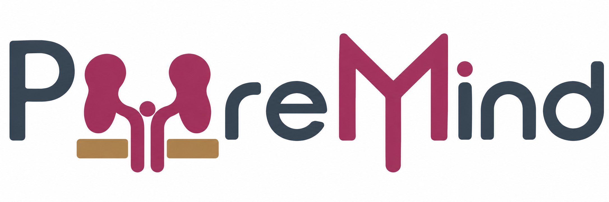
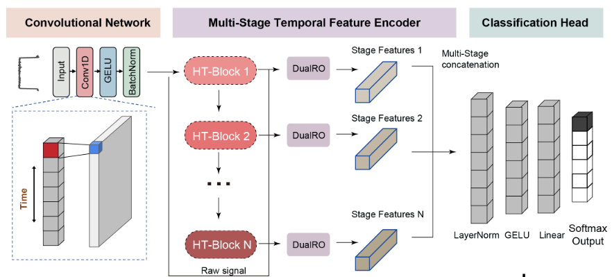
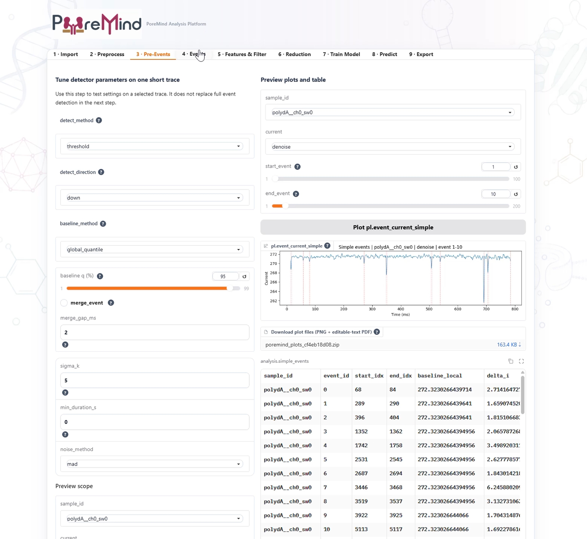

# PoreMind

[English](./README.md) | [中文](./README.zh.md)

PoreMind is a Python framework for analyzing single-molecule nanopore signals. It turns ABF and CSV current recordings into event records with a consistent format. The workflow includes signal processing, event detection, feature extraction, quality checks, machine learning, deep learning on event waveforms, and self-supervised learning. You can analyze multiple samples through the Python API, the local Web UI, or the PoreMind Agent Skill—from loading raw traces to training models and classifying events in new samples.

**Key features**

- **Events in a common format.** Each event record contains its waveform, local baseline, start and end times, sample information, and calculated features. The same event records can be used throughout the analysis.
- **Several signal-processing options.** Choose denoising, baseline-correction, and event-detection methods to suit different noise levels, current directions, baseline stability, and event shapes. Blockade filters and anomaly detection can flag or remove poor-quality events. PCA, t-SNE, and UMAP help inspect the remaining events.
- **Models for event features and waveforms.** PoreMind includes ten classical machine-learning models for event features. For event waveforms, it supports `1D-CNN`, `residual-CNN`, and custom PyTorch models. **MAGJAM** is a multi-stage temporal model that learns features to distinguish event types directly from current waveforms. It achieved the best overall results across our benchmark tasks.
- **Self-supervised learning.** These models learn a small set of features that summarize current sequences. The features can be used for visualization and classification, or compared with features calculated from event waveforms.
- **Three ways to use the same tools.** Run analyses through the Python API, the local Web UI, or the PoreMind Agent Skill. The skill lets an agent run the Python workflows from natural-language instructions.

## Installation

The package requires Python 3.10 or later. To install from GitHub:

1. Open the PoreMind GitHub repository and select **Code → Download ZIP**.
2. Extract the ZIP archive and open the extracted project folder.
3. Open a terminal in the project root—the directory containing `pyproject.toml` and `src/`.

```bash
conda create -n poremind python=3.10 -y
conda activate poremind
pip install -e .
```

Install the required dependencies:

```bash
pip install pyabf       # ABF input
pip install torch       # deep-learning training and prediction
pip install captum tqdm # identify waveform regions that affect DL predictions
pip install umap-learn  # UMAP analysis
pip install xgboost     # XGBoost support
```

## Documentation

- Documentation: [PoreMind online documentation](https://LuChenLab.github.io/PoreMind/)

## Quick Start (API)

Pass input files as a dictionary of sample IDs and file paths. Use `sample_to_group` to assign a group to each sample; feature extraction writes that group to each event's `label`.

```python
from poremind import create_analysis_object

analysis = create_analysis_object(
    {"std_A_01": "std_A_01.abf", "std_B_01": "std_B_01.abf"},
    sample_to_group={"std_A_01": "A", "std_B_01": "B"},
    reader="abf",
).load()

analysis.denoise()  # Python API default: butterworth_filtfilt

# Quickly tune event-detection parameters on a local time window.
preview_events = analysis.detect_events_simple(
    detect_method="threshold",
    start_ms=0.0,
    end_ms=1000.0,
)

# Detect events across the loaded traces, then extract and filter features.
analysis.detect_events(detect_method="threshold")
features = analysis.extract_features()
analysis.filter_events(
    method="blockade_gmm",
    parameters={"n_components": 2, "prior_mean": None},
    blockage_lim=(0.1, 1.0),
)

# Explore event features and train a classical ML model.
analysis.do_pca(feature_cols=["duration_s", "blockade_ratio"], data="filtered")
best_pkg = analysis.build_best_model(cv=5, scoring="accuracy")
analysis.pl.model_cm(model_name=best_pkg["best_model"], split="test")

# Optional DL training. Install PyTorch first if it is not already available.
dl_pkg = analysis.build_DL_model(
    model_name="MAGJAM",       # d8; use "MAGJAM_d4" for the d4 variant
    interp_length=500,
    interp_method="interp",   # or "padding"
    device="cuda",            # falls back to CPU if CUDA is unavailable
    cv=5,
)

# Reuse the trained MAGJAM package to predict events in new traces.
new_analysis, predictions = analysis.classify_new_samples(
    {"unknown_01": "unknown_01.abf"},
    reader="abf",
    model="MAGJAM",
)
```

### Supported DL models

**MAGJAM** is a multi-stage temporal-modelling network that learns discriminative dynamic representations directly from ionic-current event waveforms. Among the models evaluated in our benchmark tasks, MAGJAM achieved the strongest overall performance.

<p align="center"></p>
<p align="center">Overview of the MAGJAM framework</p>

Two depth variants are available: d8 is the default (`model_name="MAGJAM"`), and d4 is selected with `model_name="MAGJAM_d4"`.

```python
# MAGJAM d8 (default)
magjam_d8_pkg = analysis.build_DL_model(
    model_name="MAGJAM",
    device="cuda",
    interp_length=500,
    cv=5,
)

# MAGJAM d4
magjam_d4_pkg = analysis.build_DL_model(
    model_name="MAGJAM_d4",
    device="cuda",
    interp_length=500,
    cv=5,
)
```

Built-in residual CNN:

```python
residual_pkg = analysis.build_DL_model(
    model=None,
    model_name="residual-CNN",
    device="cuda",
    interp_length=500,
    expand=50,
    scale="mad",
    epoch=30,
    batch_size=64,
    learning_rate=1e-4,
    early_stop_patience=5,
    cv=5,
)
```

Custom 1D-CNN model:

```python
import torch
import torch.nn as nn


class one_DCNN(nn.Module):
    def __init__(self, out_dim: int = 10):
        super().__init__()
        self.net = nn.Sequential(
            nn.Conv1d(1, 16, kernel_size=7, padding=3),
            nn.ReLU(),
            nn.MaxPool1d(2),
            nn.Conv1d(16, 32, kernel_size=5, padding=2),
            nn.ReLU(),
            nn.MaxPool1d(2),
            nn.AdaptiveAvgPool1d(1),
            nn.Flatten(),
            nn.Linear(32, out_dim),
            nn.ReLU(),
        )

    def forward(self, x):
        return self.net(x)


cnn_pkg = analysis.build_DL_model(
    model=one_DCNN(),
    model_name="1D-CNN",
    device="cuda",
    interp_length=500,
    expand=50,
    scale="mad",
    epoch=30,
    batch_size=64,
    learning_rate=1e-4,
    early_stop_patience=5,
    cv=5,
)
```

### Model interpretability

PoreMind provides model-interpretability analyses for both classical machine-learning (ML) and deep-learning (DL) classifiers. For classical ML, permutation feature importance measures how the selected model's score changes when each feature is shuffled. The ranking reflects the model's reliance on features in the analyzed data; it does not establish causal effects. Run `build_best_model` first:

```python
ml_explanation = analysis.explain_ml(
    model_name=best_pkg["best_model"],  # optional; defaults to the selected best model
    data="filtered",
    scoring="accuracy",
    n_repeats=10,
)
print(ml_explanation["ranking"])
ml_explanation["ax"].figure  # display the permutation-importance plot in a notebook
```

For waveform-based DL models, Integrated Gradients assigns attribution scores to input positions relative to a baseline, helping identify waveform regions that contribute to a model output. These attributions describe the model's response, not causal effects. Install `captum` and `tqdm` first. Use the same `model_name` as in training; the example below uses sample ID `A8`:

```python
analysis.explain_dl(
    model_name="residual-CNN",
    method="integrated_gradients",
    baseline="zero",
    n_steps=50,
)
analysis.pl.attribute(
    sample_id="A8",
    event_index=1,
    model_name="residual-CNN",
)
```

## Notebook Example

Run the notebook example: [`notebooks/step_by_step_analysis.ipynb`](./notebooks/step_by_step_analysis.ipynb).

## Local Web UI

Start the Gradio app from the project environment:

```bash
poremind-ui
# or, from the source tree
python -m ui.app
```

After launch, the application opens in your browser automatically. You can also visit:

- http://127.0.0.1:7860/

The UI is organized into nine steps: **Import**, **Preprocess**, **Pre-Events** (local detector tuning), **Events** (full detection), **Features & Filter**, **Reduction**, **Train Model**, **Predict**, and **Export**.

In Step 8, load a saved model to classify new samples that were not used to train it.

Watch a demonstration of the PoreMind local Web UI on [YouTube](https://youtu.be/kSs1sbFrdPc):



## Notes

- **Input data:** By default, the ABF reader loads all channels and sweeps. CSV files need a `current` column and may also include a `time` column. If there is no `time` column, set the sampling rate in the reader options.
- **Labels and groups:** When features are extracted, `sample_to_group` assigns each sample's group as its events' `label`. If you do not use `sample_to_group`, add a `label` column before supervised training.
- **Preprocessing:** Available denoising methods are `butterworth_filtfilt`, `moving_average`, `median`, `drift_corrected_moving_average`, and `none`.
- **Event detection:** Methods include `threshold`, `zscore_threshold`, `cusum`, `pelt`, and `hmm`. The Python API defaults to `detect_direction="down"`, `baseline_method="rolling_quantile"` (`window=10000`, `q=0.5`), and `exclude_current=True`. Events are not merged by default. The API also supports `global_quantile` and `global_median` baselines. UI defaults may differ; set parameters explicitly to reproduce an analysis.
- **Features and filtering:** The default event features are `duration_s`, `blockade_ratio`, `segment_std`, `segment_skew`, and `segment_kurt`. Filtering methods include `blockade_gmm`, `peak_detection`, `isolation_forest`, `lof`, and `knn_background`. `blockage_lim=(0.1, 1.0)` removes events outside the blockade-ratio range before model-based filtering.
- **Models:** `build_best_model` compares and trains classical ML models. `build_DL_model` supports `residual-CNN`, `MAGJAM`, and `MAGJAM_d4`. `MAGJAM` is the d8 version; both MAGJAM versions use event waveforms and do not need precomputed event features.
- **Preparing DL waveforms:** `interp_length` defaults to `500`, and `interp_method` defaults to `"interp"`. `interp` resamples each waveform linearly. `padding` adds zeros to the end of short segments and takes a centered crop of long segments. Other options include `scale`, `expand`, `batch_size`, `learning_rate`, `epoch`, and `early_stop_patience`.
- **Predictions for new samples:** `classify_new_samples` predicts event labels with classical ML or DL models. ML output columns are `pred_label` and `pred_proba_<class>`; DL output columns are `pred_label_<model_name>` and `pred_proba_<class>_<model_name>`.
- **Model explanations and optional tools:** `analysis.plot` is an alias for `analysis.pl`. To see which waveform regions affect DL predictions, use `analysis.explain_dl` and `analysis.pl.attribute` after installing PyTorch, Captum, and tqdm. UMAP and XGBoost also require the packages listed above.

## License

PoreMind is distributed under the [PolyForm Noncommercial License 1.0.0](./LICENSE). The license permits noncommercial use; commercial use requires separate authorization from the copyright holder. See the license text for its terms and conditions.

## Contact & Citation

For questions, bug reports, or feature requests, [open an issue](https://github.com/LuChenLab/PoreMind/issues).

Defu Liu#, Jing-wen Lin⁎, Lu Chen⁎, et al. (2023). *PoreMind: a unified computational framework for single-molecule nanopore signal analysis.* [GitHub repository](https://github.com/LuChenLab/PoreMind).
